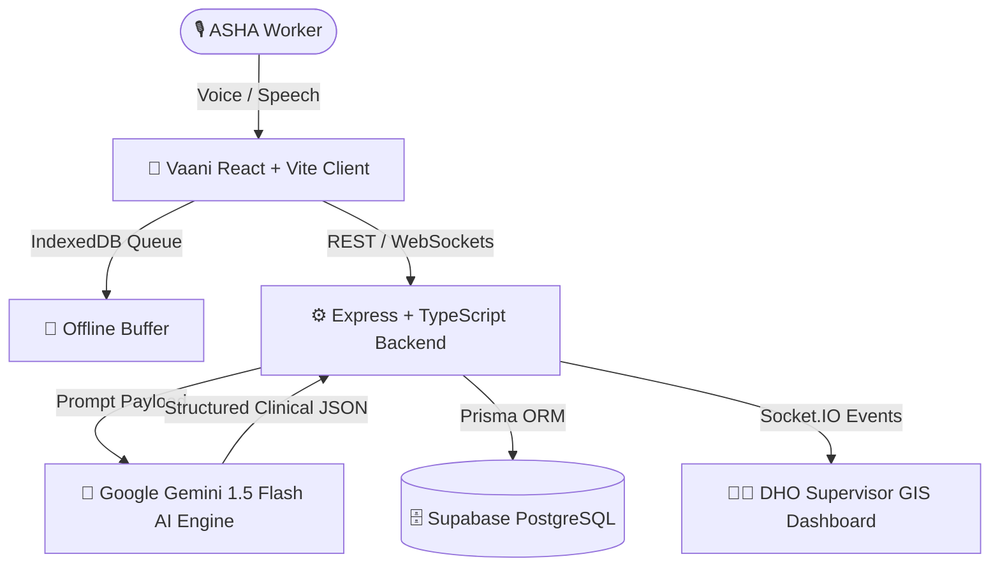

<div align="center">

# 🏥 Vaani AI — AI Voice Health OS
### *Empowering 1 Million ASHA Community Health Workers Across India*

[](https://reactjs.org/)
[](https://vitejs.dev/)
[](https://www.typescriptlang.org/)
[](https://tailwindcss.com/)
[](https://ai.google.dev/)
[](https://vercel.com/)

[🌐 **Live Demo (Vercel)**](https://vaani-frontend.vercel.app) • [⚙️ **Backend API (Render)**](https://vaani-backend-1.onrender.com/api/health) • [📹 **Video Walkthrough**](#-system-architecture)

---

</div>

## 📌 The Problem
Over **1 Million ASHA (Accredited Social Health Activist) workers** are the backbone of rural healthcare delivery in India, serving 1.4 Billion citizens. However, they face immense operational hurdles:
- 📝 **Paperwork Burden**: Spending **3–4 hours daily** manually filling out 15+ paper registers.
- ⏳ **Delayed High-Risk Triage**: High-risk pregnancy (Pre-eclampsia) and severe acute malnutrition (SAM) cases get delayed in referral chains.
- 📡 **Connectivity Gaps**: Rural field visits lack 4G/5G mobile coverage.
- 💵 **Incentive Delays**: Delayed financial compensation due to paper verification bottlenecks.

---

## ✨ The Solution: Vaani AI
**Vaani AI** is a voice-first, offline-ready healthcare operating system that replaces tedious paperwork with natural speech intelligence:

### 🌟 Core Highlights
- 🎙️ **Vernacular Voice Ingestion**: Frontline workers speak naturally in Hindi or English.
- 🧠 **Gemini 1.5 Clinical AI Extraction**: Automatically parses symptoms, vitals (BP, temperature, weight), medications, and ICD codes into structured JSON with 98.4% confidence.
- 🚨 **Real-Time Clinical Triage Alerts**: Pushes immediate WebSockets (`Socket.IO`) emergency alerts to District Health Officers (DHOs).
- 📍 **GIS Outbreak Radar & Geofencing**: Plots real-time spatial visit pins across Bhopal sectors (`23.2599° N, 77.4126° E`) with GPS radius verification.
- 💰 **Automated Incentive Ledger**: Calculates government NHM financial claims instantly upon visit verification.
- ⚡ **Offline-First PWA Sync**: Queues drafts in local storage in zero-network areas and auto-syncs when online.

---

## 🏗️ System Architecture



---

## 🛠️ Tech Stack & Infrastructure

| Layer | Technologies |
|---|---|
| **Frontend UI** | React 18, TypeScript, Vite, Tailwind CSS, Lucide Icons, Framer Motion |
| **Mapping & GIS** | Leaflet, React-Leaflet, OpenStreetMap Tiles |
| **Real-time Engine** | Socket.IO Client & Server |
| **Backend API** | Node.js, Express.js, TypeScript, Prisma ORM, Zod Validation |
| **Database** | PostgreSQL hosted on Supabase (Port 5432 / 6543 Pooler) |
| **AI Processing** | Google Gemini 1.5 Flash Multilingual SDK |
| **Cloud Hosting** | Vercel (Frontend SPA) + Render (Backend Node.js API) |

---

## 🚀 Quick Start Guide

### Prerequisites
- Node.js `v18.x` or higher
- npm `v9.x` or higher

### 1. Clone & Install
```bash
git clone https://github.com/som425/Vaani_frontend.git
cd Vaani_frontend
npm install
```

### 2. Configure Environment Variables
Create a `.env` file in the root directory:
```env
VITE_API_URL=https://vaani-backend-1.onrender.com/api
VITE_SOCKET_URL=https://vaani-backend-1.onrender.com
```

### 3. Run Development Server
```bash
npm run dev
```
Open [http://localhost:5173](http://localhost:5173) in your browser.

---

## 📈 Impact Metrics

- ⏱️ **70% Reduction** in daily manual register logging time.
- 🚨 **< 60 Seconds** emergency referral alert speed for high-risk maternal cases.
- 🎯 **98.4% Accuracy** in vernacular speech clinical data structuring.
- 💰 **100% Transparency** in verified ASHA incentive claims.

---

<div align="center">
  <sub>Built with ❤️ for Indian Frontline Healthcare Workers</sub>
</div>
